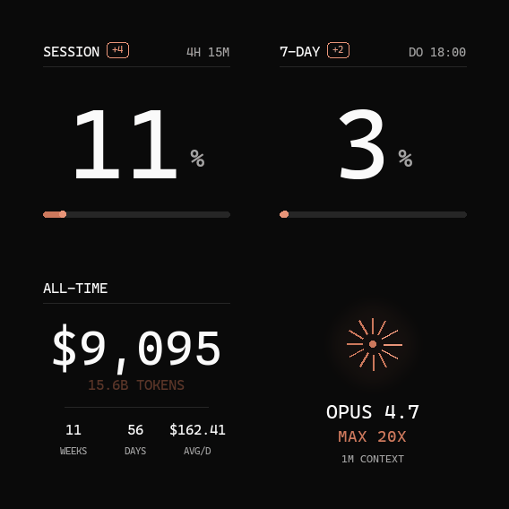

# Claude Usage Display

A live, ambient dashboard for your Anthropic Claude (Max / Pro / Code subscription)
usage limits, running on a $20 IoT desk display.



Real percentage values straight from the same endpoint that powers
`claude.ai/settings/usage` and the Claude VS Code extension's account panel.
No screen-scraping, no approximation: the bytes on the wire are what the
official Anthropic UI shows.

---

## What it does

A Python script on your machine

1. fetches your live usage limits from `api.anthropic.com/api/oauth/usage`
   using the OAuth token that Claude Code already stored locally
2. renders four 240×240 animated GIFs (session %, weekly %, all-time
   cumulative stats, plan info) in a unified dark Cloudflare-style design
3. uploads them to a GeekMagic SmallTV-Ultra over its stock HTTP API
4. tells the device to enter Photo Album mode and rotate between them

The device then plays the GIFs natively, looping each animation while
the rotation cycles through them every 8 seconds. **No firmware modification
required.**

## Screens

| | |
|--|--|
|  | **SESSION** — your 5-hour usage block percentage. The end-cap of the bar pulses gently. When the value changes between refreshes, a `+N` chip appears next to the label. |
|  | **7-DAY** — weekly limit across all models. Reset time shows weekday + clock (`DO 18:00`). Same delta-badge behavior as session. |
|  | **ALL-TIME** — cumulative cost, total tokens, weeks active, daily average. The token line subtly shimmers between `ACCENT_DIM` and `ACCENT_BRIGHT` on an eased breath cycle. |
|  | **CLAUDE** — your plan tier (read from credentials), model, and context window. The 12 spokes ripple around the ring with phase offsets, creating a soft wave instead of a robotic uniform pulse. The halo breathes on a decoupled rhythm. |

## Features

- **Real Anthropic data** — uses `/api/oauth/usage`, the same endpoint as
  claude.ai. No ccusage approximation, no token-budget guessing.
- **Delta indicator** — `+2` / `-1` chip appears when usage moves between
  refreshes. Persists via `.state/usage_last.json`.
- **Organic animations** — eased breath curves, phase-offset rippling
  spokes, decoupled halo rhythm. Designed to feel alive, not mechanical.
- **Stock firmware** — works with the device exactly as it ships. No
  flashing, no brick risk.
- **No PC dependency on the device side** — the device only runs its
  factory firmware and serves a tiny HTTP API. All compute is on your PC.

## Hardware

[GeekMagic SmallTV-Ultra](https://github.com/GeekMagicClock/smalltv-ultra)
— 240×240 IPS display, ESP32, WiFi, ~$20 on AliExpress. Stock firmware
ships a Photo Album mode that natively plays both JPG and animated GIF
files uploaded over HTTP.

This project was developed against firmware `Ultra-V9.0.21`.

## Setup

### Requirements

- **Claude Code** installed and logged in (the OAuth credentials in
  `~/.claude/.credentials.json` are what powers the live data). Works
  for Claude Max, Pro, and Code subscribers.
- **Python 3.11+**
- **Pillow** (image rendering — `pip install -r requirements.txt`)
- **Node.js** if you want the all-time cumulative screen — that one uses
  [ccusage](https://github.com/ryoppippi/ccusage) via `npx`. Skip if you
  don't care about all-time stats.
- **curl** on PATH (used for file upload — see [`device.py`](device.py)
  for why)
- A **Cascadia Code** font at `C:/Windows/Fonts/CascadiaCode.ttf` (ships
  with Windows 11). Adjust [`src/screens/theme.py`](src/screens/theme.py)
  if you're on macOS / Linux.

### Install

```bash
git clone https://github.com/btobiasde/claude-usage-display
cd claude-usage-display
pip install -r requirements.txt

cp config.example.py config.py
# edit config.py — set DEVICE_IP to your SmallTV-Ultra's LAN IP
```

### One-shot render

```bash
python render.py        # writes 4 GIFs into out/
```

### Push to device

```bash
python -c "
import device, config
from pathlib import Path
import urllib.request

for name in ['session.gif', 'weekly.gif', 'alltime.gif', 'claude.gif']:
    device.upload(Path('out') / name, config.REMOTE_DIR)
device.set_theme(3)  # Photo Album
urllib.request.urlopen(
    f'http://{config.DEVICE_IP}/set?i_i={config.SCREEN_ROTATE_SECONDS}&autoplay=1',
    timeout=10,
).read()
"
```

### Live loop

```bash
python run.py           # renders + uploads every DATA_REFRESH_SECONDS
```

Stop with Ctrl+C. For autostart on Windows: drop a `pythonw.exe run.py`
shortcut into `shell:startup`.

## Architecture

```
                       ┌─────────────────────────────┐
                       │  api.anthropic.com          │
                       │    /api/oauth/usage         │
                       └─────────────┬───────────────┘
                                     │ Bearer <oauth>
                                     ▼
┌──────────────────────────────────────────────────────┐
│  YOUR PC                                             │
│                                                      │
│   usage_api.py ──► data.py ──► state.py              │
│        │             │            │                  │
│        └────────► render.py ──────┘                  │
│                      │                               │
│                      ▼                               │
│              src/screens/*.py                        │
│              (PIL, 240×240, animated GIF)            │
│                      │                               │
│                      ▼                               │
│                 ./out/*.gif ─────► device.py         │
└──────────────────────────────────────┼───────────────┘
                                       │ HTTP POST /doUpload
                                       ▼
                              ┌─────────────────────┐
                              │ SmallTV-Ultra       │
                              │ Photo Album mode    │
                              │ rotates GIFs        │
                              └─────────────────────┘
```

Module roles:

| File | Role |
|---|---|
| `usage_api.py` | Anthropic OAuth usage client. Reads bearer token from `~/.claude/.credentials.json`, calls `/api/oauth/usage`, returns parsed `Bucket` objects. |
| `data.py` | ccusage wrapper. Only used for the all-time cumulative screen (Anthropic's API doesn't expose cumulative cost). |
| `state.py` | Persists previous `five_hour_pct` / `seven_day_pct` to `.state/usage_last.json` so the next render can compute deltas. |
| `device.py` | GeekMagic HTTP client. `upload()` shells out to `curl` because the firmware's `/doUpload` response sends two `Content-Length` headers, which Python's urllib3 rejects. |
| `render.py` | Orchestrator. Pulls live data, computes deltas, calls each screen's `render_gif()`, saves state. |
| `run.py` | Loop driver — calls `render_all()` every `DATA_REFRESH_SECONDS`. |
| `src/screens/theme.py` | Design tokens — colors, fonts, easing functions, color-blend helper. |
| `src/screens/_limit.py` | Shared template for SESSION and 7-DAY (label + huge %, animated end-cap, delta badge). |
| `src/screens/{session,weekly,alltime,claude_info}.py` | The four screen renderers. |

## Documentation

- [`docs/ANTHROPIC_API.md`](docs/ANTHROPIC_API.md) — the reverse-engineered
  `/api/oauth/usage` endpoint, response schema, how the auth works
- [`docs/DEVICE_API.md`](docs/DEVICE_API.md) — every GeekMagic SmallTV-Ultra
  HTTP endpoint, observed quirks, gotchas
- [`docs/DESIGN.md`](docs/DESIGN.md) — design tokens, animation philosophy,
  why eased polyrhythms beat sync'd sine waves
- [`research/README.md`](research/README.md) — how the Anthropic endpoint
  was discovered (grep'ing the Claude VS Code extension binary), and a
  copy of the stock firmware's web UI for reference

## Privacy & security

- The script reads `~/.claude/.credentials.json` (your local Claude Code
  OAuth token) only to make outbound HTTPS requests to
  `api.anthropic.com`. The token never leaves your machine except in
  those requests.
- The GeekMagic device exposes an **unauthenticated** HTTP API on your
  LAN. Anyone on the same network can upload files or change settings.
  Put it on an IoT VLAN if that bothers you; don't port-forward.
- `config.py` (containing your device's LAN IP) is gitignored. The
  committed file is `config.example.py`.

## Credits

- [GeekMagic](https://github.com/GeekMagicClock/smalltv-ultra) — for
  shipping a hackable IoT display with a documented(-ish) HTTP API.
- [ccusage](https://github.com/ryoppippi/ccusage) — for the local
  Claude-Code log parser that powers the all-time screen.
- Anthropic's VS Code extension team — for shipping the unminified-enough
  endpoint name in `extension.js`. The Bearer-auth `/api/oauth/usage`
  pattern was found by grepping the extension code.

## License

MIT — see [LICENSE](LICENSE).
